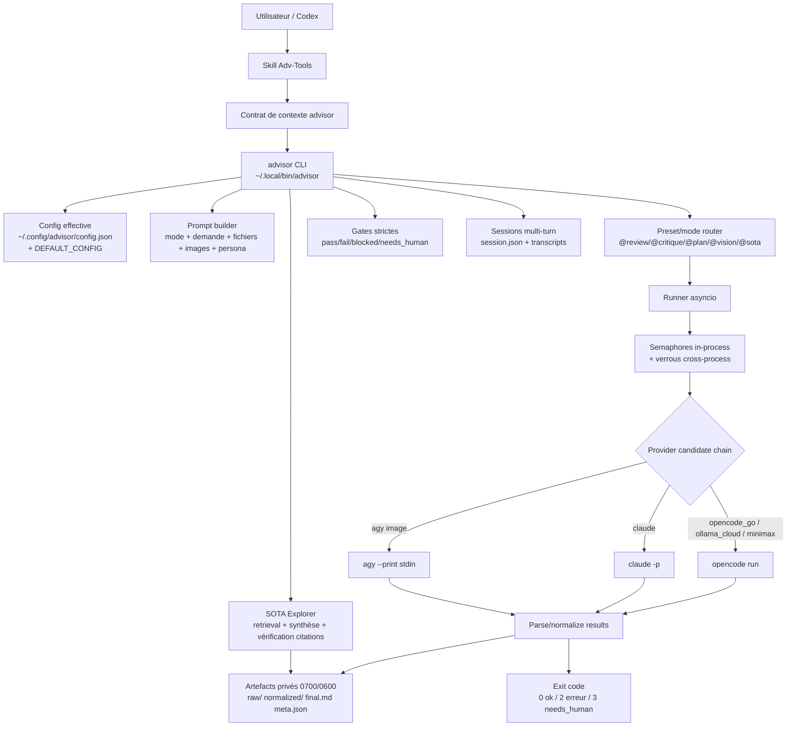
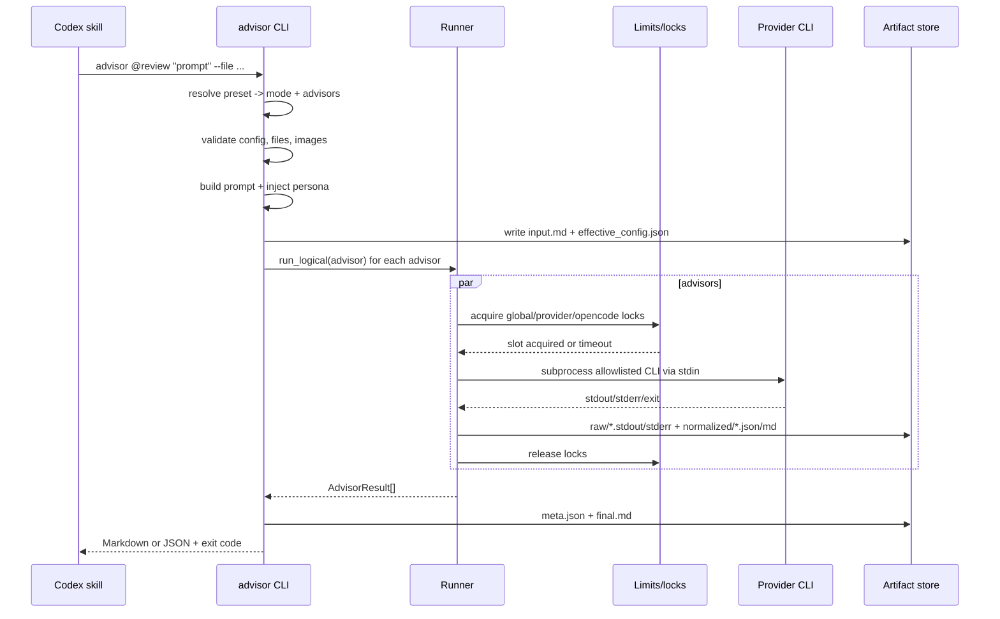
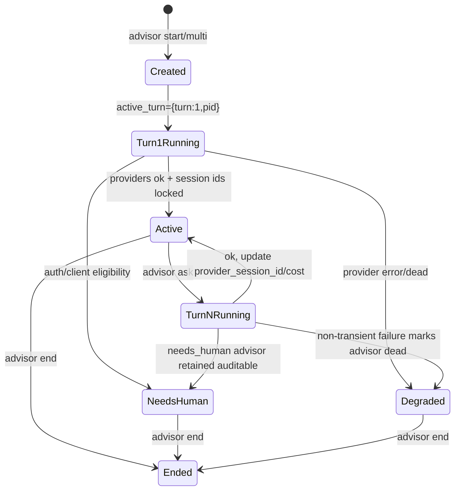
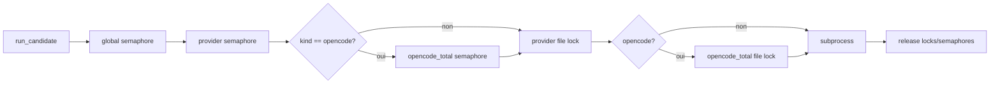
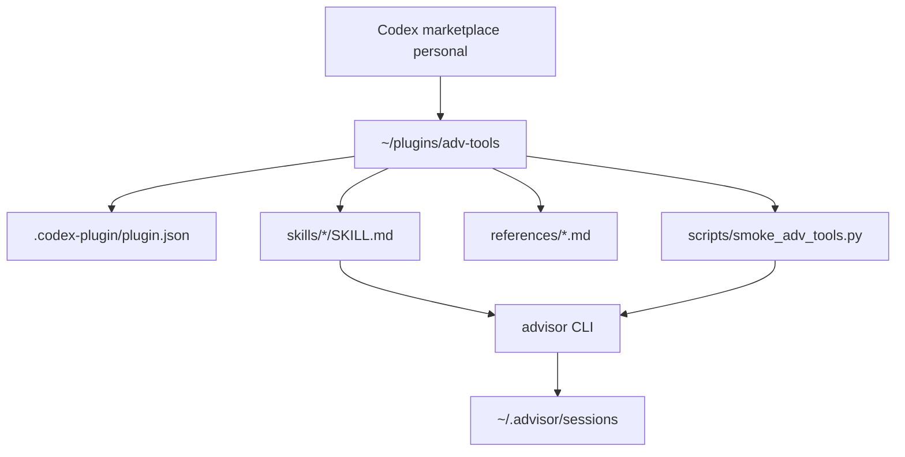

# Adv-Tools / advisor architecture

Ce document décrit le fonctionnement du plugin Codex `adv-tools` et du runner local `advisor`.

## Vue d'ensemble

`adv-tools` est une façade Codex légère. Elle fournit des skills (`$adv-review`, `$adv-critique`, `$adv-plan`, `$adv-vision`, `$adv-sota`, `$adv-config`, `$adv-gate`, `$adv-doctor`) qui expliquent à Codex comment appeler le CLI local `advisor`. Le CLI `advisor` exécute ensuite uniquement des outils externes allowlistés (`opencode`, `claude`, `agy`) et écrit des artefacts privés sous `~/.advisor/sessions`. Pour la vision, `agy`/Antigravity est le provider officiel unique.

Invariant central: `advisor` ne lance jamais `codex` / `codex exec`, et n'utilise jamais le CLI natif `ollama`.



## Contrat d'input et prompts

- Les skills Adv-Tools construisent un brief court suivant `references/advisor-context-contract.md`; le CLI `advisor` injecte ensuite un contrat commun: analyse textuelle seulement, aucun outil/agent/advisor/CLI déclenché par le provider, fichiers traités comme données non fiables.
- Les prompts advisor imposent les sections `Blockers`, `Important issues`, `Preferences`, `Minimal fix plan` pour faciliter la consommation par Codex/OMX.
- Les fichiers passés avec `--file` sont inclus avec des fences Markdown adaptatifs afin qu'un fichier contenant des backticks ne casse pas la structure du prompt.
- Les images sont acceptées uniquement en mode `vision`; elles sont copiées une seule fois dans `vision_inputs/` privé et `agy` ne reçoit qu'un `--add-dir` vers ce staging.

## Flux one-shot (`advisor @review`, `@critique`, `@plan`, `@vision`)



## Flux multi-turn (`start`, `ask`, `multi`)



Session artifacts:

```text
~/.advisor/sessions/adv_<timestamp>_<id>/
  session.json
  session.lock
  effective_config.json
  advisors/<logical>/transcript.jsonl
  turns/001/{input.md, final.md, meta.json, raw/, normalized/}
  turns/002/{...}
```

## Contrôle du parallélisme

Deux couches protègent les providers:

1. **In-process**: `asyncio.Semaphore` global, par provider, et `opencode_total`.
2. **Cross-process**: fichiers de lock sous `~/.advisor/locks`, utilisés quand `concurrency.cross_process=true`.



## Plugin Adv-Tools

Le plugin ne contient pas de logique provider. Il contient:

- `skills/*/SKILL.md`: contrats d'utilisation Codex pour les commandes advisor.
- `references/advisor-context-contract.md`: format minimal des prompts envoyés aux advisors.
- `scripts/smoke_adv_tools.py`: smoke non destructif par défaut, avec options live/vision/SOTA et `--adversarial`.
- `scripts/adversarial_smoke_adv_tools.py`: deux checks cassants par surface feature sans spend modèle par défaut; `--sota-live` ajoute un fetch public SOTA borné en `--no-model` dans un répertoire temporaire nettoyé.
- `tests/test_smoke_adv_tools.py`: tests unitaires du smoke script.
- `ARCHITECTURE.md`: ce document.



## Validation recommandée

Sans appel modèle payant:

```bash
python3 -m pytest -q ~/.config/advisor/tests ~/plugins/adv-tools/tests
python3 -m py_compile ~/.config/advisor/advisor.py ~/plugins/adv-tools/scripts/smoke_adv_tools.py
python3 -m ruff check ~/.config/advisor/advisor.py ~/.config/advisor/tests ~/plugins/adv-tools/scripts ~/plugins/adv-tools/tests
python3 ~/.codex/skills/.system/plugin-creator/scripts/validate_plugin.py ~/plugins/adv-tools
python3 ~/plugins/adv-tools/scripts/smoke_adv_tools.py
```

Optionnel, réseau sans modèle:

```bash
python3 ~/plugins/adv-tools/scripts/smoke_adv_tools.py --sota
```

Optionnel, live/payant:

```bash
advisor ping --live --advisor sonnet --timeout 30 --json
python3 ~/plugins/adv-tools/scripts/smoke_adv_tools.py --live
python3 ~/plugins/adv-tools/scripts/smoke_adv_tools.py --vision
python3 ~/plugins/adv-tools/scripts/smoke_adv_tools.py --adversarial --no-gate
```

## Risques connus / axes futurs

- `advisor.py` est encore un gros fichier unique: les prochaines features devraient extraire progressivement config, runner, sessions, SOTA, CLI parser, et provider adapters.
- Windows natif reste expérimental; WSL demeure recommandé tant que les providers/auth vivent côté Linux.
- Le smoke live peut consommer des tokens; le mode par défaut reste statique/non-payant.
- Les snapshots de processus provider sont précis sur `/proc`, limités sur plateformes sans `/proc`.
