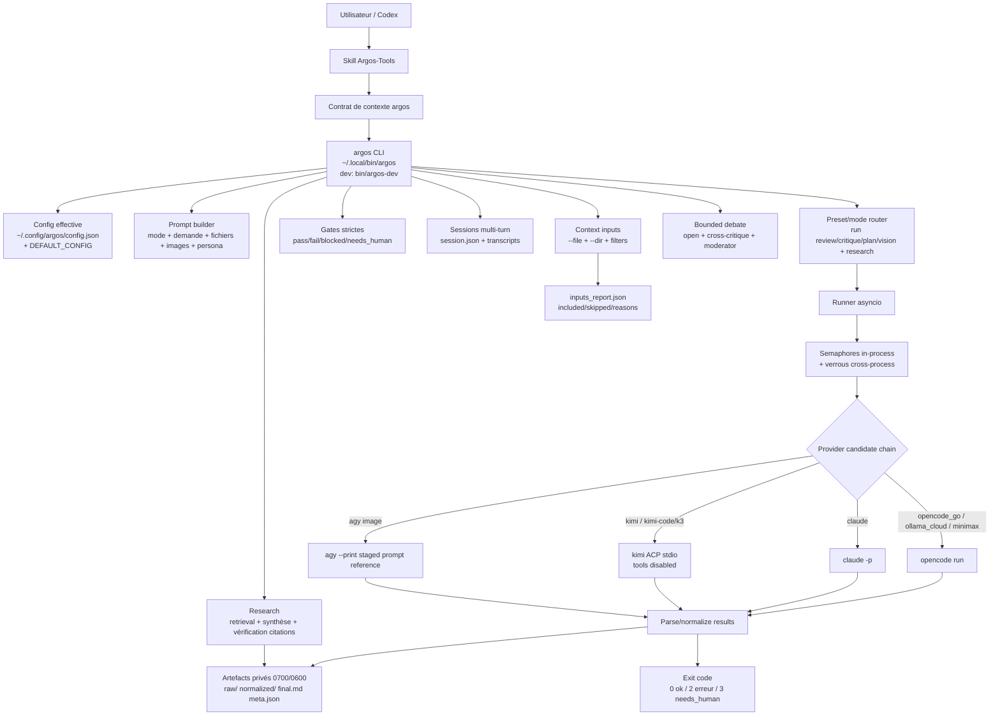
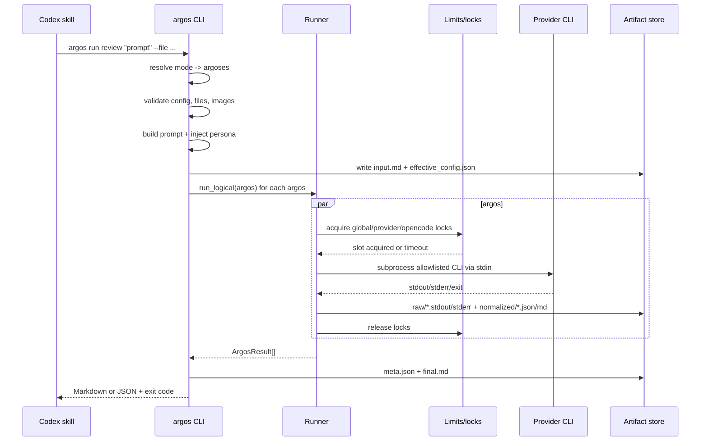
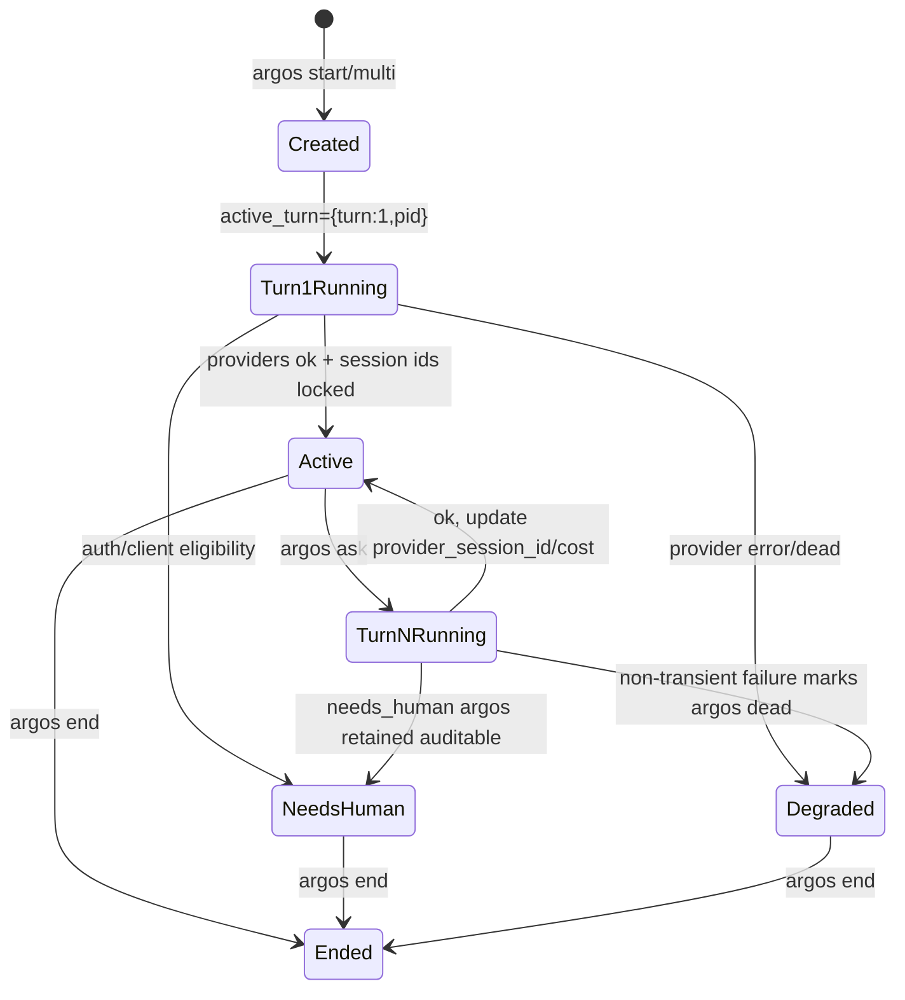
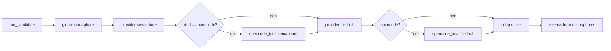
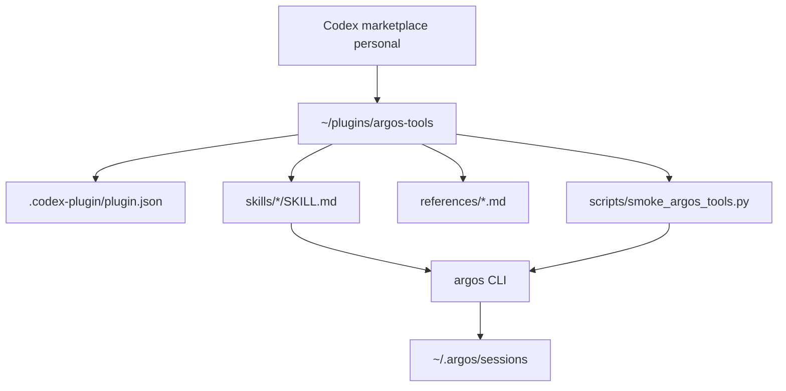

# Argos-Tools / argos architecture

Ce document décrit le fonctionnement du plugin Codex `argos-tools` et du runner local `argos` (core: `argos/argos.py`, lancé en développement via `bin/argos-dev`).

## Vue d'ensemble

`argos-tools` est une façade Codex légère. Elle expose une surface réduite de skills (`$argos`, `$argos-review`, `$argos-critique`, `$argos-plan`, `$argos-council`, `$argos-research`) qui expliquent à Codex comment appeler le CLI local `argos`. Le CLI `argos` exécute ensuite uniquement des outils externes allowlistés (`opencode`, `claude`, `kimi`, `agy`) et écrit des artefacts privés sous `~/.argos/sessions`.

Invariant central: `argos` ne lance jamais `codex` / `codex exec`, et n'utilise jamais le CLI natif `ollama`.


```mermaid
flowchart TB
  User[Utilisateur / Codex] --> Skill[Skill Argos-Tools]
  Skill --> Contract[Contrat de contexte argos]
  Contract --> CLI[argos CLI\n~/.local/bin/argos\ndev: bin/argos-dev]

  CLI --> Config[Config effective\n~/.config/argos/config.json\n+ DEFAULT_CONFIG]
  CLI --> Prompt[Prompt builder\nmode + demande + fichiers + images + persona]
  CLI --> Router[Preset/mode router\nrun review/critique/plan/vision + research]

  Router --> Runner[Runner asyncio]
  Runner --> Limits[Semaphores in-process\n+ verrous cross-process]
  Limits --> Providers{Provider candidate chain}

  Providers -->|opencode_go / ollama_cloud / minimax| OpenCode[opencode run]
  Providers -->|claude| Claude[claude -p]
  Providers -->|kimi / kimi-code/k3| Kimi[kimi ACP stdio\ntools disabled]
  Providers -->|agy image| Agy[agy --print staged prompt reference]

  OpenCode --> Parse[Parse/normalize results]
  Claude --> Parse
  Kimi --> Parse
  Agy --> Parse

  Parse --> Artifacts[Artefacts privés 0700/0600\nraw/ normalized/ final.md meta.json]
  Parse --> Exit[Exit code\n0 ok / 2 erreur / 3 needs_human]

  CLI --> Gates[Gates strictes\npass/fail/blocked/needs_human]
  CLI --> Sessions[Sessions multi-turn\nsession.json + transcripts]
  CLI --> Context[Context inputs\n--file + --dir + filters]
  Context --> Report[inputs_report.json\nincluded/skipped/reasons]
  CLI --> Debate[Bounded debate\nopen + cross-critique + moderator]
  CLI --> Research[Research\nretrieval + synthèse + vérification citations]
  Research --> Artifacts
```

## Contrat d'input et prompts

- Les skills Argos-Tools construisent un brief court suivant `references/argos-context-contract.md`; le CLI `argos` injecte ensuite un socle de sécurité commun et un contrat propre à chaque workflow. Un mode conversationnel ne reçoit donc pas par accident le format d'une review.
- Les registres `roles`, `lenses` et `assignments` composent l'angle demandé indépendamment du provider/modèle. `personas` reste un fallback de compatibilité. Chaque nouvel appel provider reçoit un `prompt_manifest` avec provenance, hashes, phase, budget et taille; un tour repris conserve l'affectation sans la réinjecter.
- Les modes de revue imposent les sections `Blockers`, `Important issues`, `Preferences`, `Minimal fix plan` pour faciliter la consommation par Codex/OMX. Le mode `council` utilise un contrat conversationnel neutre, préserve le message courant dans un bloc verbatim et supprime les affectations spécialisées.
- Les fichiers passés avec `--file` sont inclus avec des fences Markdown adaptatifs afin qu'un fichier contenant des backticks ne casse pas la structure du prompt.
- Pour les prompts longs ou générés depuis un fichier, le CLI accepte `--prompt-file` sur `run`, `start` et `ask`. En PowerShell, privilégier `argos run review --prompt-file .\prompt.md --file ...` plutôt qu'une chaîne shell lourdement échappée.
- `--dir` est disponible sur `run`, `start`, `ask`, `multi` et `debate`. Le parcours est déterministe, UTF-8 uniquement, fail-closed pour symlinks/reparse points, borné, et audité dans `inputs_report.json`.
- Le cycle conversationnel comprend `history`, `export`, `rename`, `reopen`, `retry` et `fork`. Un résultat `outcome_unknown` n'est jamais retryable automatiquement.
- `$argos-council` s'appuie sur ce cycle : Codex fige sa réponse indépendante avant l'appel, chaque provider conserve son historique isolé, puis `argos council publish` persiste la synthèse user-visible et `ask` la joint automatiquement comme contexte partagé au tour suivant.
- `debate` orchestre un nombre borné de rounds. Les réponses croisées sont balisées comme données non fiables; le contenu provider ne pilote jamais le nombre de rounds ou des commandes.
- Les reviews écrivent un ledger déterministe `findings.json`; les boucles s'arrêtent sur absence de delta, répétition identique ou budget maximal plutôt que de répéter le même prompt.
- La recherche écrit `coverage.json` avant toute synthèse. Une couverture insuffisante bloque les appels modèle, sauf override explicite et audité.
- Les images sont acceptées uniquement en mode `vision`; elles sont copiées une seule fois dans `vision_inputs/` privé. Le prompt AGY complet est lui aussi écrit dans un staging privé et AGY ne reçoit sur sa ligne de commande qu'un chemin court vers ce fichier, avec les `--add-dir` nécessaires.

## Flux one-shot (`argos run review/critique/plan/vision`)


```mermaid
sequenceDiagram
  participant C as Codex skill
  participant A as argos CLI
  participant R as Runner
  participant L as Limits/locks
  participant P as Provider CLI
  participant FS as Artifact store

  C->>A: argos run review "prompt" --file ...
  A->>A: resolve mode -> argoses
  A->>A: validate config, files, images
  A->>A: build prompt + inject persona
  A->>FS: write input.md + effective_config.json
  A->>R: run_logical(argos) for each argos
  par argos
    R->>L: acquire global/provider/opencode locks
    L-->>R: slot acquired or timeout
    R->>P: subprocess allowlisted CLI via stdin
    P-->>R: stdout/stderr/exit
    R->>FS: raw/*.stdout/stderr + normalized/*.json/md
    R->>L: release locks
  end
  R-->>A: ArgosResult[]
  A->>FS: meta.json + final.md
  A-->>C: Markdown or JSON + exit code
```

## Flux multi-turn (`start`, `ask`, `multi`)


```mermaid
stateDiagram-v2
  [*] --> Created: argos start/multi
  Created --> Turn1Running: active_turn={turn:1,pid}
  Turn1Running --> Active: providers ok + session ids locked
  Turn1Running --> NeedsHuman: auth/client eligibility
  Turn1Running --> Degraded: provider error/dead
  Active --> TurnNRunning: argos ask
  TurnNRunning --> Active: ok, update provider_session_id/cost
  TurnNRunning --> NeedsHuman: needs_human argos retained auditable
  TurnNRunning --> Degraded: non-transient failure marks argos dead
  Active --> Ended: argos end
  NeedsHuman --> Ended: argos end
  Degraded --> Ended: argos end
```

Session artifacts:

```text
~/.argos/sessions/adv_<timestamp>_<id>/
  session.json
  session.lock
  effective_config.json
  argoses/<logical>/transcript.jsonl
  turns/001/{input.md, final.md, meta.json, raw/, normalized/}
  turns/002/{...}
```

## Contrôle du parallélisme

Deux couches protègent les providers:

1. **In-process**: `asyncio.Semaphore` global, par provider, et `opencode_total`.
2. **Cross-process**: fichiers de lock sous `~/.argos/locks`, utilisés quand `concurrency.cross_process=true`.

`kimi` et `kimi3` sont deux voix logiques compatibles mais non diverses : elles
partagent le même verrou provider `kimi=1` et le même modèle `kimi-code/k3`,
tout en conservant des sessions distinctes. Le transport direct utilise ACP v1
sur stdio, jamais le prompt dans argv.


```mermaid
flowchart LR
  Task[run_candidate] --> G[global semaphore]
  G --> P[provider semaphore]
  P --> O{kind == opencode?}
  O -->|oui| OT[opencode_total semaphore]
  O -->|non| X[provider file lock]
  OT --> X
  X --> Y{opencode?}
  Y -->|oui| XL[opencode_total file lock]
  Y -->|non| Exec[subprocess]
  XL --> Exec
  Exec --> Release[release locks/semaphores]
```

## Plugin Argos-Tools

Le plugin ne contient pas de logique provider. Il contient:

- `skills/*/SKILL.md`: contrats d'utilisation Codex pour les commandes argos.
- `references/argos-context-contract.md`: format minimal des prompts envoyés aux argos.
- `scripts/smoke_argos_tools.py`: smoke non destructif par défaut, avec options live/vision/SOTA et `--adversarial`.
- `scripts/adversarial_smoke_argos_tools.py`: deux checks cassants par surface feature sans spend modèle par défaut; `--research-live` ajoute un fetch public borné en `--no-model` dans un répertoire temporaire nettoyé.
- `tests/test_smoke_argos_tools.py`: tests unitaires du smoke script.
- `ARCHITECTURE.md`: ce document.


```mermaid
flowchart TB
  Marketplace[Codex marketplace personal] --> Plugin[~/plugins/argos-tools]
  Plugin --> Manifest[.codex-plugin/plugin.json]
  Plugin --> Skills[skills/*/SKILL.md]
  Plugin --> References[references/*.md]
  Plugin --> Smoke[scripts/smoke_argos_tools.py]
  Skills --> Argos[argos CLI]
  Smoke --> Argos
  Argos --> Artifacts[~/.argos/sessions]
```

## Validation recommandée

Sans appel modèle payant:

```bash
python3 -m pytest -q ~/.config/argos/tests ~/plugins/argos-tools/tests
python3 -m py_compile ~/.config/argos/argos.py ~/plugins/argos-tools/scripts/smoke_argos_tools.py
python3 -m ruff check ~/.config/argos/argos.py ~/.config/argos/tests ~/plugins/argos-tools/scripts ~/plugins/argos-tools/tests
python3 ~/.codex/skills/.system/plugin-creator/scripts/validate_plugin.py ~/plugins/argos-tools
python3 ~/plugins/argos-tools/scripts/smoke_argos_tools.py
```

Optionnel, réseau sans modèle:

```bash
python3 ~/plugins/argos-tools/scripts/smoke_argos_tools.py --research
```

Optionnel, live/payant:

```bash
argos ping --live --argos sonnet --timeout 30 --json
python3 ~/plugins/argos-tools/scripts/smoke_argos_tools.py --live
python3 ~/plugins/argos-tools/scripts/smoke_argos_tools.py --vision
python3 ~/plugins/argos-tools/scripts/smoke_argos_tools.py --adversarial --no-gate
```

## Sujet MCP

Le bridge MCP est maintenant implémenté localement dans `argos/mcp_server.py`
avec son adaptateur contractuel dans `argos/mcp_adapter.py`. La cible
documentée dans `references/mcp-bridge-plan.md` est devenue la forme
d'exécution réelle.

Le principe retenu est simple:

- un seul serveur MCP local en stdio comme source de vérité;
- une surface typée et étroite (`argos_run`, `argos_start`, `argos_ask`,
  `argos_council_show`, `argos_council_publish`, `argos_research`,
  `argos_health` et lecture de sessions), sans commande shell brute;
- des ressources en lecture seule pour les sessions, synthèses, manifests,
  couverture, findings et artefacts;
- des permissions séparées pour écriture d'artefacts, egress modèle,
  retrieval et override de couverture insuffisante;
- une compatibilité d'attache Claude Code + Codex au même backend local.

Le serveur utilise le SDK Python officiel épinglé à `mcp==2.0.0` dans les
métadonnées PEP 723 de l'entrypoint. `argos/mcp_runtime.py` prépare une fois
un environnement versionné dans le cache utilisateur et vérifie réellement
les imports natifs avant de le déclarer prêt. Les deux hôtes exécutent ensuite
directement le Python retourné; `uv run --script` reste un fallback de smoke,
pas la recette hôte, car son cold start peut dépasser leurs timeouts.

Bootstrap commun:

```powershell
$repo = (Resolve-Path ".").Path
$runtime = uv run python (Join-Path $repo "argos\mcp_runtime.py") `
  --workspace $repo `
  --json | ConvertFrom-Json
```

Claude Code:

```powershell
claude mcp add argos --scope local `
  -e ARGOS_WORKSPACE=$repo `
  -- $runtime.runtime_python $runtime.server_path
claude mcp get argos

$env:MCP_TIMEOUT = '120000'
$env:MCP_CONNECTION_NONBLOCKING = '0'
$env:MCP_CONNECT_TIMEOUT_MS = '60000'
claude
```

Codex:

```powershell
codex mcp add argos `
  --env ARGOS_WORKSPACE=$repo `
  -- $runtime.runtime_python $runtime.server_path
codex mcp get argos
```

Codex exige en plus `startup_timeout_sec = 120` dans
`[mcp_servers.argos]`. Ses outils MCP peuvent être différés: le chemin normal
est une découverte par tool search, puis l'appel de `argos_health` ou du tool
de workflow voulu.

Le serveur expose les templates de ressources MCP suivants:

- `argos://sessions/{session_id}/summary`
- `argos://sessions/{session_id}/turns/{turn}`
- `argos://sessions/{session_id}/artifacts`
- `argos://councils/{council_id}/summary`
- `argos://councils/{council_id}/turns/{turn}`
- `argos://runs/{request_id}/manifest`
- `argos://runs/{request_id}/coverage`
- `argos://runs/{request_id}/findings`

Les smokes officiels couvrent le serveur in-process et un vrai sous-processus
stdio:

```powershell
uv run --with mcp==2.0.0 --with pytest python -m pytest `
  argos/tests/test_mcp_contract.py `
  argos/tests/test_mcp_adapter.py `
  argos/tests/test_mcp_runtime.py `
  argos/tests/test_mcp_server.py `
  argos/tests/test_mcp_stdio.py -q
```

Avec `$env:ARGOS_MCP_RUNTIME_PYTHON = $runtime.runtime_python`, ces smokes
stdio utilisent exactement le lancement direct des hôtes. Sans cette
variable, ils conservent volontairement le fallback PEP 723 portable.

## Risques connus / axes futurs

- `argos/argos.py` est encore un gros fichier unique: les prochaines features devraient extraire progressivement config, runner, sessions, SOTA, CLI parser, et provider adapters.
- La parité Windows native est désormais assurée (kill d'arborescence de processus via `taskkill /F /T`, wrappers `.cmd`/`.ps1`); aucun emplacement local particulier n'est requis.
- Le smoke live peut consommer des tokens; le mode par défaut reste statique/non-payant.
- Les snapshots de processus provider sont précis sur `/proc`, limités sur plateformes sans `/proc`.
